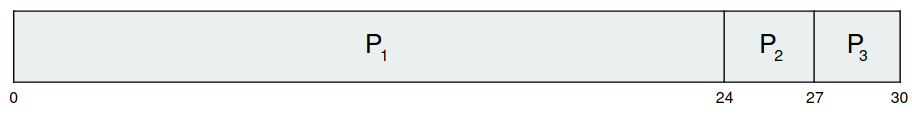

# CPU Scheduling

## Basic Concepts

In a single processor system only on process can run at a time. The objective of muti-programing is  is to have some process running at all times, to maximize CPU utilization.

Several processes are kept in memory at one time. When one process has to wait, the operating system takes the CPU away from that process and gives the CPU to another process. This pattern continues.

**Every time one process has to wait, another process can take over use of the CPU**.

### CPU - I/O Burst Cycle

Process execution consists of a cycle of CPU execution and I/O wait. Processes alternate between these two states. Process execution begins with a CPU burst. That is followed by an I/O burst, which is followed by another CPU burst, and so on. Eventually, the final CPU burst ends with a system request to terminate execution.

An I/O - bound program typically has many short CPU burst. A CPU-bound program might have a few long CPU burst. This distribution can be important in the selection of an appropriate CPU-scheduling algorithm.

### CPU Scheduler

The operating system must select one the processes in the ready queue to be executed. The selection is carried out by the short-term scheduler, or CPU scheduler. The scheduler selects a process from the processes in memory that are ready to execute and allocates the CPU to that process.

### Preemptive Scheduling

CPU-scheduling mat take place under the following four circumstances:

1. When a processes switches from the running state to the waiting state
2. When a process switches from the running state to the ready state
3. When a process switches from the waiting state to the ready state
4. When a process terminates

When scheduling takes place only under circumstances 1 and 4, we say that the scheduling scheme is non-preemptive or cooperative. Otherwise, it is preemptive.

**Non-preemptive**:

Once the CPU has been allocated to a process, the process keeps the CPU until it releases the CPU either by terminating or by switching to the waiting state.

**Preemptive**:

Can result in race conditions when data are shared among several processes. Consider the case of two processes that share data. While one process is updating the data, it is preempted so that the second process can run. The second process then tries to read the data, which are in inconsistent state.

### Dispatcher

The dispatcher is the module that gives control of the CPU to the process selected by the short-term scheduler. This function involves the following:

- Switching context
- Switching to user mode
- Jumping to the proper location in the user program to restart that program

The dispatcher should be as fast as possible, since it is invoked during every process switch. The time it takes for the dispatcher to stop one process and start another running is known as the dispatch latency.

## Scheduling Criteria

**CPU utilization**: Keep the CPU as busy as possible.

**Throughput**: Number of processes that are completed per time unit, called throughput.

**Turnaround time**: How long it takes to execute that process. The interval from the time of submission of a process to the time of completion is the turnaround time.

**Waiting time**: The CPU-scheduling algorithm does not affect the amount of time during which a process executes or does I/O. It affects only the amount of time that a process spends waiting in the ready queue.

**Response time**: Is the time it takes to start responding, not the time it takes to output the response. The turnaround time is generally limited by the speed of the output device.

## Scheduling Algorithms

### First-Come, First-Served Scheduling

| Process | Burst Time |
| --- | --- |
| $P_1$ | 24 |
| $P_2$ | 3 |
| $P_3$ | 3 |

Suppose that the processes arrive in the order: $P_1$, $P_2$, $P_3$. The Gantt Chart  the schedule is:

Waiting time for $P_1$ = 0; $P_2$ = 24; $P_3$ = 27

Average waiting time: $(0+24+27)/3 = 17$ msec

Suppose that the processes arrive in the order: P_2, P_3, P_1. The Gantt Chart  the schedule is: 

Waiting time for $P_1$ = 6; $P_2$ = 0; $P_3$ = 3

Average waiting time: $(6+0+3)/3 = 3$ msec

Much better than previous case 

- **Convoy effect**: short process behind long process
    - Consider one CPU-bound and many I/O-bound processes

### Shortest-Job-First Scheduling

Associate with each process the length of its next CPU burst.

- Use these lengths to schedule the process with the shortest time

SJF os optimal → gives minimum average waiting time for a given set of processes

- The difficulty is knowing the length of the next CPU request
- Could ask the user

| Process | Burst Time |
| --- | --- |
| $P_1$ | 6 |
| $P_2$ | 8 |
| $P_3$ | 7 |
| $P_4$ | 3 |

Average waiting time = $(3+16+9+0)/4 = 7$ msec

Can only estimate the length → should be similar to the previous one

- Then pick process with shortest predicted next CPU burst

Can be done by using the length of previous CPU bursts, using exponential averaging

Preemptive version called **shortest-remaining-time-first**

Prediction of the length of the next CPU burst:

Now we add the concepts of varying arrival times and preemption to the analysis

| Process | Arrival Time | Burst Time |
| --- | --- | --- |
| $P_1$ | 0 | 8 |
| $P_2$ | 1 | 4 |
| $P_3$ | 2 | 9 |
| $P_4$ | 3 | 5 |

Preemptive SJF Gantt Chart

Average waiting time = $[(10-1)+(1-1)+17-2+5-3)]/4 = 26/4 = 6.5$ msec

### Priority Scheduling

A priority number (integer) is associated with each process

The CPU is allocated to the process with the highest priority (smallest integer = highest priority)

- Preemptive
- Non-preemptive

SJF is priority scheduling where priority is the inverse of predicted next CPU burst time

Problem: Starvation - low priority processes may never execute

Solution: Aging - as time progresses increase the priority of the process

| Process | Arrival Time | Burst Time |
| --- | --- | --- |
| $P_1$ | 10 | 3 |
| $P_2$ | 1 | 1 |
| $P_3$ | 2 | 4 |
| $P_4$ | 1 | 5 |
| $P_5$ | 5 | 2 |

Priority scheduling Gantt Chart

Average waiting time = 8.2 msec

### Round-Robin Scheduling

Each process gets a small unit of CPU time, usually 10-100 milliseconds. After this time has elapsed, the process is preempted and added to the end of the ready queue.

If there are n processes in the ready queue and the time quantum is q, then each process gets 1/n of the CPU time in chunks of at most q time units at once. No process waits more than (n-1)q time units.

Timer interrupts every quantum to schedule next process

Performance

- q large ⇒ FIFO
- q small ⇒ q must be large with respect to context switch, otherwise overhead is too high

| Process | Burst Time |
| --- | --- |
| $P_1$ | 24 |
| $P_2$ | 3 |
| $P_3$ | 3 |

The Gantt chart is:

Typically, higher average turnaround than SJF, but better response

q should be large compared to context switch time

q usually 10ms to 100ms, context switch < 10 usec

### Multilevel Queue Scheduling

Ready queue is partitioned into separate queues:

- Foreground (interactive)
- Background (batch)

Process permanently in a given queu

Each queue has its own scheduling algorithm:

- Foreground - RR
- Background - FCFS

Scheduling must be done between the queues:

- Fixed priority scheduling;
- Time slice → each queue gets a certain amount of CPU time which it can schedule amongst its processes.
- 20% to background in FCFS

### Multilevel Feedback Queue Scheduling

A process can move between the various queues; aging can be implemented this way

Multilevel-feedback-queue scheduler defined by the following parameters:

- Number of queues
- Scheduling algorithms for each queue
- Method used to determine when to upgrade a process
- Method used to determine when to demote a process
- Method used to determine which queue a process will enter when that process needs service

Three queues:

- $Q_0$ → RR with time quantum 8 milliseconds
- $Q_1$ → RR time quantum 16 milliseconds
- $Q_2$ → FCFS

Scheduling 

A new job enters queue $Q_0$ which is served FCFS

- When it gains CPU, job receives 8 milliseconds
- If it does not finish in 8 milliseconds, job is moved to queue $Q_1$

At $Q_1$ job is again served FCFS and receives 16 additional milliseconds

- If it still does not complete, it is preempted and moved to queue $Q_2$

## Thread Scheduling

On operating systems that support treads, it is kernel-level treads - not processes - that are being scheduled by the OS. User-level treads are managed by a thread library, and the kernel is unaware of them. To run on CPU, user-level threads must ultimately be mapped to an associated kernel-level thread.

### Contention Scope

User-level threads and kernel-level distinction relies in how they are scheduled.

The thread library schedules user-level threads to run on available LWP → Process-contention Scope (PCS), since competition for the CPU takes place among threads belonging to the same process.

To decide which kernel-level thread to schedule onto a CPU, the kernel uses system-contention scope (SCS). Competition for the CPU with de SCS scheduling takes place among all threads in the system.

Systems using many-to-one and many-to-many model → PCS

Systems using one-to-one model → SCS

Typically, PCS is done according to priority - the scheduler selects the runnable thread with the highest priority to run. User-level thread priorities are set by the programmer and are not adjusted by the thread library, although some thread libraries may allow the programmer to change the priority of  a thread. PCS will typically preempt the thread currently running in favor of a higher-priority thread; however, there is no guarantee of time slicing among threads of equal priority.

### Pthread Scheduling

Pthreads identifies the following contention scope values

- PTHREAD_SCOPE_PROCESS schedules threads using PCS scheduling.
- PTHREAD_SCOPE_SYSTEM schedules threads using SCS scheduling.

On systems implementing the many-to-many model, the PTHREAD_SCOPE_PROCESS policy schedules user-level threads onto available LWPs. The number of LWPs is maintained by the thread library, perhaps using scheduler activations. The PTHREAD_SCOPE_SYSTEM scheduling policy will create and bind an LWP for each user-level thread on many-tomany systems, effectiely mapping threads using the one-to-one policy.

The Pthread provides two functions for getting - and setting - the contention scope polity:

- pthread_attr_setscope(pthread_attr_t *attr, int scope)
- pthread_attr_getscope(pthread_attr_t *attr, int *scope)

## Multiple-Processor Scheduling

If multiple processors are available , load sharing becomes possible - but scheduling problems become correspondingly more complex.

### Approaches to Multiple-Processor Scheduling

**One approach** to CPU scheduling in a multi-processor system all scheduling decisions, I/O processing, and other systems activities handled by a single processor - the master server.

The other processors execute only user code. This asymmetric multi-processing is simple because only one processor accesses the system data structure, reducing the need for data sharing

A **second approach** uses symmetric multiprocessing (SMP), where each processor is self-scheduling. All processes may be in a common ready queue, or each processor may have its own private queue of ready processes. In that case, we must ensure that two separate processors do not choose to schedule the same process and that processes are not lost from the queue.

### Processor Affinity.

 A processor has an affinity for the processor on which it is currently running.

When an OS has a policy of attempting to keep process running on the same processor, but  not guaranteeing that it will do so. → soft affinity.

The OS will attempt to keep a process on a single processor, but it is possible for a process to migrate between processors. In contrast, some systems provide system calls that support hard affinity, thereby allowing a process to specify a subset of processors on which it may run.

### Load Balancing

It is important to keep the workload balanced among all processors to fully utilize the benefits of having more than one processor.

Load balancing attempts to keep the workload evenly distributed across all processors in an SMP system.

Load balancing is typically necessary only on systems where each processor has its own private queue of eligible processor to execute. On system with a common run queue, load balancing is often unnecessary, because once a processor becomes idle, it immediately extracts a runnable process from the common run queue.

Two approaches to load balancing:

1. **Push migration**: A specific task periodically checks the load on each processor and - if it finds an imbalance - evenly distributes the load by moving (or pushing) processors from overloaded to idle or less-busy processors. 
2. **Pull migration**: Pull migration occurs when an idle processor pulls a waiting taks from a busy processor

Push and pull migration need to not be mutually exclusive and are in fact often implemented in parallel on load-balancing systems.

### Multi-core Processors

To place multiple processor cores in the same physical chip, resulting in a multi-core processor. Each core maintains its architectural state and thus appears to the operating system to be a separate physical processor.

Hardware design have implemented multi-threaded processor cores in which two (or more) hardware threads are assigned to each core. That way, if one thread stalls while waiting for memory, the core can switch to another thread.

Two ways to multi-thread a processing core:

1. Coarce-grained: A thread executes on a processor until a long-latency event such as a memory stall occurs. Because of the delay of the long-latency event, the processor must switch to another thread to begin execution. → switching cost is high
2. Fine-grained: Switches between threads at a much finer lever of granularity - typically at the boundary of an instruction cycle. → include logic for thread switching, as a result the coast is small.

Two levels of scheduling for multi-threaded multi-core processors:

1. Scheduling decisions that must be made by the operating system as it chooses which software thread to run on each hardware thread.
2. Specifies how each core decides which hardware thread to run. 

## Real-time CPU Scheduling

Soft real-time systems: provides no guarantee as to when a critical real-time process will be scheduled. They guarantee only that the process will be given preference over noncritical processes.

Hard real-time systems: have stricter requirements. A task must be serviced by its deadline; service after the deadline has expired is the same as no service at all.

### Minimizing Latency

When an event occur, the system must respond to and service it as quickly as possible. We refer to event latency as the amount of time that elapses from when an event occurs to when it is serviced.

Two types of latency:

1. Interrupt latency
    
    Refers to the period of time from the arrival of an interrupt at the CPU to the start of the routine that services the interrupt. When an interrupts occurs, the OS must first complete the instruction it is executing and determine the type of interrupt that occurred. It must then save the state of the current process before servicing the interrupt using the specific service routine (ISR). The total time required to perform these tasks is the interrupt latency.
    
2. Dispatch latency
    
    The amount of time required for the scheduling dispatcher to stop one process and start another is known as dispatch latency. Providing real-time tasks with immediate access to the CPU mandates that real-time operating systems minimize this latency as well.
    
    The conflict phase of dispatch latency has two components:
    
    - Preemption of any process running in the kernel
    - Release by low-priority processes of resources needed by a high-priority process.

### Priority-Based Scheduling

For real-time scheduling must support preemptive, priority-based scheduling → but only guarantees soft real-time.

For hard real-time must also provide ability to meet deadlines

Processes have new characteristics: periodic ones require CPU at constant intervals: periodic ones require CPU at constant intervals

- Has processing time T, deadline d, period p
- 0 ≤ t ≤ d ≤ p
- Rate of periodic task is 1/p

Virtualization software schedules multiple guests onto CPU(s)

Each guest doing its own scheduling

- Not knowing it doesn’t own the CPUs
- Can result in poor response time
- Can effect time-of-day clocks in guests

Can undo good scheduling algorithm efforts of guests

### Rate Montonic Scheduling

A priority is assigned based on the inverse of its period

Shorter periods = higher priority

Longer periods = lower priority

$P_1$ is assigned a higher priority than $P_2$

### Earliest Deadline First Scheduling (EDF)

Priorities are assigned according to deadlines:

The earlies the deadline, the higher the priority

The later the deadline, the lower the priority

### Proportional Share Scheduling

T shares are allocated among all processes in the system

An application receives N shares where N < T

This ensure each application will receive N/T of the total processor time

### POSIX Real-Time Scheduling

The POSIX.1b standard

API provides functions for managing real-time threads

Defines two scheduling classes for real-time threads:

1. SCHED_FIFO - threads are scheduled using FCFS strategy with a FIFO queue. There is no time-slicing for threads of equal priority.
2. SCHED_RR - similar to SCHED_FIFO execept time-slicing occurs for threads of equal priority

Defines two functions for getting and setting scheduling policy:

1. pthread_attr_getsched_policy(pthread_attr_t *attr, int *policy)
2. pthread_attr_setsched_policy(pthread_attr_t *attr, int policy)