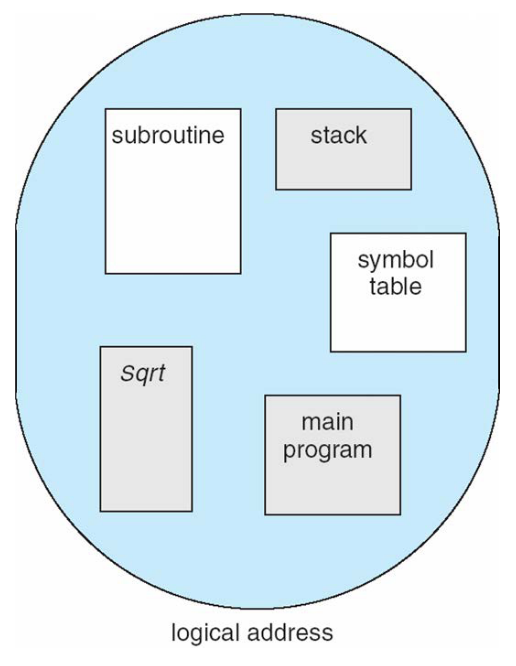

# Main Memory

## Background

Memory consists of a large array of bytes, each with its own address. The CPU fetches instructions from memory according to the value of the program counter. These instructions may cause additional loading from and storing to specific memory addresses.

### Basic Hardware

Separate- per-process memory space protects the process from each other and is fundamental to having multiple processes loaded in memory for concurrent execution.

- Base register
- Limit register

Any attempt by a program executing in user mode to access operating-system memory or other users memory results in a trap to the operating system

### Address Binding

The processes on the disk that are waiting to be brought into memory for execution form the input queue.

Addresses in the source program are generally symbolic. A compiler typically binds these symbolic addresses to relocatable addresses. The linkage editor or loader in turn binds the relocatable addresses to absolute addresses. Each binding is a mapping from one address space to another.

Address binding of instructions and data to memory addresses can happen at three different stages:

- Compile time: if memory location known a priori, absolute code can be generated; must recompile code if starting location changes.
- Load Time: must generate relocatable code if memory location is not known at compile time.
- Execution time: binding delayed until run time if the process can be moved during its execution from one memory segment to another
    - Need hardware support for address maps

### Logical Versus Physical Address Space

An address generated by the CPU is referred as a logical address.

Whereas an address seen by the memory unit - that is, the one loaded into the memory-address register of the memory - is commonly referred to as a physical address.

Compile-time and load-time generate identical logical and physical addresses. The execution-time address binding scheme results in differing logical and physical addresses. In this case we refer to the logical address as a virtual address.

The set of all logical addresses generated by a program is a logical address space. The set of all physical addresses corresponding to these logical addresses is a physical address space. Thus, in the execution-time address-binding scheme, the logical and physical address spaces differ.

Run-time mapping from virtual to physical addresses is done by memory-management unit (MMU)

The user program never sees the real physical address. The user program deals with logical addresses. The memory-mapping hardware converts logical addresses into physical addresses. The final location of referenced memory address is not determined until the reference is made.

### Dynamic Loading

To obtain better memory-space utilization, we can use dynamic loading. 

A routine is not loaded until it is called. All routines are kept on disk in a relocatable load format. The main program is loaded into memory and is executed. When a routine needs to call another routine, the calling routine first checks to see whether the other routine has been loaded. If it has not, the relocatable lining loader is called to load the desired routine into memory and to update the program’s address tables to reflect this change. Then control is passed to newly loaded routine.

### Dynamic Linking and Shared Libraries

Dynamically linked libraries are system libraries that are linked to user programs when the programs are run. Linking is postponed until execution time.

A stub is included in the image for each library-routine reference. The stub is a small piece of code that indicates how to locate the appropriate memory-resident library routine or how to load the library if the routine is not already present. The stub replaces it self  with the address of the routine and executes the routine.

## Swapping

A process can be swapped temporarily out of memory to a backing store, and then brought back into memory for continued execution

- Total physical memory space of processes can exceed physical memory

Backing store: Fast disk enough to accommodate copies of all memory images for all users; must provide direct access these memory images

Roll out, roll in: swapping variant used for priority-based scheduling algorithms; lower-priority process is swapped out so higher-priority process can be loaded and executed

Major part of swap time is transfer time; total transfer time is directly proportional to the amount of memory swapped

System maintains a ready queue of ready-to-run processes which have memory images on disk

### Standard Swapping

If next processes to be put on CPU is not in memory, need to swap out a process and swap in target processes

Context switch time can then be very high

Standard swapping not used in modern operating systems → modified version: swap only when free memory extremely low.

### Swapping on Mobile Systems

Not typically supported → Flash memory based

- Small amount of space
- Limited number of write cycles
- Poor throughput between flash memory and CPU on mobile platform

Instead use other methods to free memory if low

- iOS asks apps to voluntarily relinquish allocated memory
    - Read-only data thrown out and reloaded from flash if needed
    - Failure to free can result in termination
- Android terminates apps if low free memory, but first writes application state to flash for fast restart

## Contiguous Allocation

→ Main memory must support both OS and user processes

→ Limited resource, must allocate efficiently

→ Contiguous allocation is one early method

Main memory usually into two partitions:

- Resident operating system, usually held in low memory with interrupt vector
- User processes then held in high memory
- Each process contained in single contiguous section of memory

Relocation registers used to protect user processes from each other, and from changing operating-system code and data

- Base register contains value of smallest physical address
- Limit register contains range of logical addresses → each logical address must be less than the limit register
- MMU maps logical address dynamically
- Can than allow actions such as kernel code being transient and kernel changing size

### Memory Allocation

**Multiple-partition allocation**

- Variable-partition sizes for efficiency (sized to a given process’ needs)
- Hole → block of available memory; holes of various size are scattered throughout memory
- When a process arrives, it is allocated memory from a hole large enough to accommodate it
- Process exiting frees its partition, adjacent free partition combined
- Operating system maintains information about:
    - Allocated partitions
    - Free partitions (hole)

**Dynamic  storage-allocation**

How to satisfy a request of size n form a list of free holes?

- First-fit: allocate the first hole that is big enough
- Best-fit: allocate the smallest hole that is big enough; must search entire list, unless ordered by size
    - Produces the smallest leftover hole
- Worst-fit: allocate the largest hole; must also search entire list
    - Produces the largest leftover hole

First-fit and best-fit better than worst-fit in terms of speed and storage utilization

### Fragmentation

External fragmentation: total memory space exists to satisfy a request, but it is not contiguous

Internal fragmentation: allocated memory may be slightly larger than requested memory; this size difference is memory internal to a partition, but not being used

First fit analysis reveals that given N blocks allocated, 0.5 N blocks lost to fragmentation

- 1/3 may be unusable → 50-percent rule

Reduce external fragmentation by compaction

- Shuffle memory contents to place all free memory together in one large block
- Compaction is possible only if relocation is dynamic, and is done at execution time
- I/O problem
    - Latch job in memory while it is involved in I/O
    - Do I/O only onto OS buffers
- Now consider that backing stores has name fragmentation problems

## Segmentation

→ Memory-management scheme that support user view of memory

→ A program is a collection of segments

→ A segment is a logical unit such as:

→ Main program

→ Procedure

→ Function

→ Method

→ Object

→ Local variables, global variables

→ Stack

Logical address consists of two tuple → <segment-number, offset>

Segment table → maps two-dimensional physical addresses; each table entry has:

- Base: contains the starting physical address where the segments reside in memory
- Limit: specifies the length of the segment

Segment-table base register (STBR) points to the segment table’s location in memory

Segment-table length register (STLR) indicates number of segments used by a programs

- Segment number s is legal if s < STLR

Protection

- With each entry in segment table associate:
    - Validation bit = 0 ⇒ segment
    - read/write/execute privileges
- Protection bits associated with segments; code sharing occurs at segment level
- Since segments vary in length, memory allocation is a dynamic storage-allocation problem

## Paging

Physical address space of a process can be noncontinuous; process is allocated physical memory whenever the latter is available

- Avoids external fragmentation
- Avoids problem of varying sized chunks

Divide physical memory into fixed-sized blocks called frames

- Size of power of 2, between 512 bytes and 16 Mbytes

Divide logical memory into blocks of same size called pages

Keep track of all free frames

To run a program of size N pages, need to find N free frames and load program

Set up a page table to translate logical to physical addresses 

Backing store likewise split into pages

Still have internal fragmentation

Address generated by the CPU is divided into:

- Page number (p) → used as an index into a page table which contains base address of each page in physical memory
- Page offset (d) → combined with the base address to define the physical memory address that is sent to the memory unit

### Hardware Support

→ Page table is kept in main memory

→ Page-table base register (PTBR) points to the page table

→ Page-table length register (PTLR) indicates size of the page table

In this scheme every data/instruction access access requires two memory accesses

- One for the page table and one for the data/instruction

The two memory access problem can be solved by use of a spacial fast-lookup hardware cache called associative memory or translation look-aside buffers (TLB)

Some TLBs store address-space identifiers (ASIDs) in each TLB entry - uniquely identifies each process to provide address-space protection for that process

- Otherwise need to flush at every context switch

TLBs typically small (64 to 1024 entries)

On a TLB miss, value is loaded into the TLB for faster access next time

- Replacement policies must be considered
- Some entries can be wired down for permanent fast access

### Protection

Memory protection implemented by associating protection bit with each frame to indicate if read-only or read-write access is allowed

- Can also add more bits to indicate page execute-only, and so on

Valid-invalid bit attached to each entry in the page table:

- “valid” indicates that the associated page is in the process’ logical address space, and is thus a legal page
- “invalid” indicates that the page is not in the process’ logical address space
- Or use page-table length register (PTLR)

Any violations result in a trap to the kernel

### Shared Pages

Shared code

- One copy of read-only (reentrant) code shared among processes
- Similar to multiple threads sharing the same process space
- Also useful for inter-process communication if sharing of read-write pages is allowed

Private code and data

- Each process keeps a separate copy of the code and data
- The pages for the private code and data can appear anywhere in the logical address space

