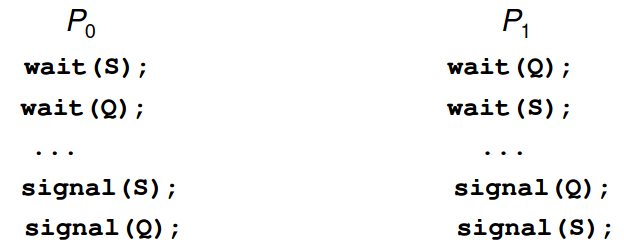

# Process Synchronization

## The Critical-Section Problem

Critical section: a segment of code, in which the process may be changing common variables, updating a table, writing a file, and so on.

When one process is executing in its critical section, no other process is allowed to execute in its critical section. That is, no two processes are executing in their critical sections at  the same time.

The critical-section problem is to design a protocol that the processes can use to cooperate. Each process must request permission to enter its critical section. The section of code implementing this request is the entry section. The critical section may be followed by an exit section. The remaining code is the remainder section.

A solution must satisfy the following three requirements:

1. Mutual exclusion. If process $P_1$ is executing in its critical section, then no other processes can be executing in their critical section.
2. Progress. If no process is executing in its critical section and some processes wish to enter their critical section, then only those processes that are not executing in their remainder sections can participate in deciding which will enter its critical section next, and this selection cannot be postponed indefinitely.
3. Bounded waiting. There exists a bound, or limit, on number of times that other processes are allowed to enter their critical sections after a process has made a request to enter its critical section and before that request is granted.

Two approaches are used to handle critical sections in operating systems:

- Preemptive kernels → allows process to be preempted while it is running in kernel mode.
- Non-preemptive kernels → does not allow a process running in kernel mode to be preempted

## Peterson’s Solution

Peterson’s Solution is restricted to two processes that alternate execution between their critical sections and remainder sections. The processes are numbered $P_0$ and $P_1$. For convenience, when presenting $P_i$, we use $P_j$ to denote the other process; that is, j equals 1 - i.

Require the two processes to share two data items:

```c
int turn;
boolean flag[2];
```

*turn* indicates whose turn it is to enter its critical section. That is, if turn == 1, then process $P_i$ is allowed to execute in its critical section.

*flag* array is used to indicate if a process is ready to enter its critical section. If flag[i] is true, this value indicates that $P_1$ is ready to enter its critical section.

To enter the critical section, process P_i first sets flag[i] to be  true and then sets turn to the value j, thereby asserting that if the other process wishes to enter the critical section, it can do so. If both processes try to enter at the same time, turn will be set to both i and j at roughly the same time. Only on of these assignments will last; the other will occur but will be overwritten immediately. The eventual value of turn determines which of the processes is allowed to enter its critical section first.

To prove the solution is correct, we need to show that:

1. Mutual exclusion is preserved
2. The progress requirement is satisfied
3. The bounded-waiting requirement is met.

## Mutex Locks

We use mutex lock to protect critical regions an thus prevent race conditions. That is, a proces must acquire the lock before entering a critical seciton; it releases the lock when it exists the critical section.

```c
acquire() {
	while(!available)
		; /* busy wait */
		available = false;;
}
do {
//acquire lcok
	critical section
//release lock
	remainder section
} while(true);

release() {
	available = true;
}
```

If the lock is available, a call to acquire() succeeds, and the lock is then considered unavailable. A process that attempts to acquire an unavailable lock is blocked until the lock is released.

The main disadvantages of the implementation given here is that it requires busy waiting. While a process is in its critical section, any other process that tries to enter its critical section must loop continuously int the call to acquire();

When locks are expected to be held for short times, spinlocks are useful useful. They are often employed on multiprocessor systems where one thread can “spin” on one processor while another thread performs its critical section on another processor.

## Semaphores

A semaphore S is an integer variable that, apart from initialization, is accessed  only through two standard atomic operations: wait() and signal().

The wait() operation was originally termed P.

The signal() was originally called V.

```c
wait(S) {
	while(S<=)
		; // busy wait
	S--;
}
signal(S) {
	S++;
}
```

When one process modifies the semaphore value, no other process can simultaneously modify that same semaphore value. → executed indivisibly

In addition, in the case of wait(S), the testing of the integer value of S (S ≤ 0), as well as its possible

### Semaphore Usage

**Counting semaphore**: the value can range over an unrestricted domain.

**Binary semaphore**: the value can range between 0 and 1. → behave similarly to mutex locks.

Counting semaphores can be used to control access to a given resource consisting of a finite number of instances.

Each process that wishes to use resource perform a wait() operation on the semaphore. When a process releases a resource, it performs a signal() operation. When the count for the semaphore goes to 0, all resources are being used. After that, processes that wish to use a resource will block until the count becomes greater than 0. 

### Semaphore Implementation

A process that is blocked, waiting on a semaphore S, should be restarted when some other process executes a signal() operation. The process is restarted by a wakeup() operation, which changes the process from the waiting state to the ready state. The process is then placed in the ready queue.

(the CPU may or may not be switched from running process to the newly ready process, depending on the CPU-scheduling algorithm)

We define a semaphore as follows:

```c
typedef struc {
	int value;
	struct process *list;
} semaphore;
```

Each semaphore has an integer value and a list of processes list. When a process must wait on semaphore, it is added to the list of processes. A signal() operation removes one process from the list of waiting processes and awakens that process.

```c
wait(semaphore *S) {
	S->value--;
	if (S->value<0) {
		add this process to S->list;
		block();
	}
}
```

and the signal semaphore can be defined as:

```c
signal(semaphore *S) {
	S->value++;
	if (S->value <= 0) {
		remove a process P from S->list;
		wakeup(P);
	}
}
```

The block() operation suspends the process that invokes it. The wakeup(P) operation resumes the execution of a blocked process P. The two operations are provided by the operating system as basic system calls.

### Deadlocks and Starvation

Deadlock → two or more processes are waiting indefinitely for an event that can be caused by only one of the waiting processes.

Let S and Q be two semaphores initialized to 1



Starvation/indefinite blocking → a situation in which processes wait indefinitely withing the semaphore.

- A process may never be removed from the semaphore queue in which it is suspended

**Priority Inversion** → Scheduling problem when lower-priority process holds a lock needed by higher-priority process

- Solved via priority-inheritance protocol