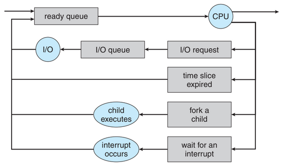

# Processes

A system consists of a collection of processes: operating-system processes executing system code and user processes executing user code.

## Process Concept

A process is a program in execution.

- Program code → text section
- Current activity → program counter
- Contents of the processor’s registers
- Process stack → temporary data (function, parameters, return addresses and local variables)
- Data section → global variables
- Heap → memory that is dynamically allocated during process run time

Program: passive entity → file containing a list of instructions stored on a disk (executable file).

Process: active entity, with a program counter specifying the next instruction to execute and a set of associated resources.

As a process executes, it changes state.

→ **New**: the process is being created;

→ **Running**: the process are being executed;

→ **Waiting**: the process is waiting for some event to occur (such as an I/O completion or reception a a signal);

→ **Ready**: the process is waiting to be assigned to a process;

→ **Terminated**: the process has finished execution;

Each process is represented in the operating system by a process control block (PCB) / Task Control Block.

PCB contains many pieces of information associated with a specific process, including these:

- Process state;
- Program counter → indicate the address of the next instruction;
- CPU register;
- CPU-scheduling information → includes a process priority, pointers to scheduling queues;
- Memory-management information;
- Accounting information → includes the amount of CPU and real time used, time limits, account numbers, job or process, etc;
- I/O status information → includes the list of I/O devices allocated to the process, a list of open files, etc;

## Process Scheduling

Multi-programming objective: have some process running at all time, to maximize CPU utilization.

Time sharing objective: switch the CPU among processes so frequently that users can interact with each program while is running.

Process scheduler selects an available process (probably from a list of several available processes) for program execution on the CPU.

For a single-processor system, there will never be more than one running process. If there are more processes, the rest will have to wait until the CPU is free and can be rescheduled.

### Scheduling Queues

Processes are put into a job queue, which consists of all processes in the system. 

Processes that are residing in main memory and are ready and waiting to execute are kept on a list called the ready queue → stored as a linked list. A ready-queue header contains pointers to the first and final PCBs in the list. Each PCB includes a pointer field that points to the next PCB in the queue.



Each rectangular box represents a queue. Two types of queues are present: the ready queue and a set of device queues. The circles represent the resources that serve the queues, and the arrows indicate the flow of processes in the system.

Once the process is allocated in the CPU and is executing:

→ The process could issue an I/O request and the be placed in a I/O queue;

→ The process could create a new child process and wait for the child’s termination;

→ The process could be removed forcibly from the CPU, as a result of an interrupt, and be put back in the ready queue.

### Schedulers

The OS must select, for scheduling purposes, processes from these queues in some fashion. The selection process is carried out by the appropriate scheduler.

In a batch system, more processes are submitted than can be executed immediately → spooled to a mass-storage device (typically a disk), where they kept for later execution. 

- The long-term scheduler, or job scheduler, selects processes from this pool and loads them into memory for execution
- The short-term scheduler, or CPU scheduler, selects from among the processes that are ready to execute and allocates the CPU to one of them.

Differences between these two schedulers:

- frequency of execution
    - Short-term scheduler must select a new process for the CPU frequently → milliseconds → wait I/O request.
    - Long-term scheduler executes less frequently → controls the degree of multi-programming (number of processes in memory). Because of the longer interval between executions, the long-term scheduler can afford to take more time to decide which process should be selected for execution.

Processes can be described as either:

- I/O-bound process: spends more time doing I/O than computations, many short CPU bursts
- CPU-bound process - spends more time doing computations; few very long CPU bursts

### Context Switch

Interrupts cause the OS to change a CPU from its current task and to run a kernel routine → happen frequently on general-purpose systems.

When an interrupt occur, the system needs to save the current context of the process running on the CPU → the context is represented in the PCB of the process.

Generically, we perform a state save of the current state of the CPU, be it in kernel or user mode, and then a state restore to resume operations.

Context switch: Switching the CPU to another process → performing a state save of the current process and a state restore of a different process. 

Context-switch time is overhead, because the system does no useful work while switching → time depend on hardware support.

## Operations on Processes

### Process Creation

During the course of execution, a process may create several new processes.

- Creating process → parent process
- New process → children of that process

Each of the children process may in turn create other processes, forming a tree of processes

OS identify process by process identifier (pid) → integer number

The children process my be able to obtain its resources from the operating system, or it may be constrained to a subset of the resources of the parent process.

Two possibilities for execution:

1. The parent continues to execute concurrently with its children.
2. The parent waits until some or all its children have terminated.

Two address-space for the new process:

1. The child process is a duplicate of the parent process (it has the same program and data as the parent);
2. The child process has a new program loaded into it.

```c
int main() {
	pid t pid;
	/* fork a child process */
	pid = fork();
	if (pid < 0) { /* error occurred */
		fprintf(stderr, "Fork Failed");
		return 1;
	}
	else if (pid == 0) { /* child process */
		execlp("/bin/ls","ls",NULL);
	}
	else { /* parent process */
		/* parent will wait for the child to complete */
		wait(NULL);
		printf("Child Complete");
	}
	return 0;
}
```

### Process Termination

A process terminates when it finishes executing its final statement and asks the operating system to delete it by using exit() system call; All the resources of the process - including physical and virtual memory, open files, and I/O buffers - are de-allocated by the operating system.

A parent may terminate the execution of one of its children for a variety of reasons:

- The child has exceeded its usage of some of the resources that it has been allocated. → parent must have a mechanism to inspect the state of its children.
- The task assigned to the build is no longer required.
- The parent is exiting, and the operating system does not allow a child to continue if its parent terminates.

In some systems if a process terminates, then all its children must also be terminated → cascading termination.

```c
/* exit with status 1 */
exit(1);
```

A parent may wait for the termination of a child process by using the wait() system call. The wait() is passed a parameter that allows the parent to obtain the exit status of the child. It also returns the process identifier of the terminated child.

```c
pid_t pid;
int status;

pid = wait(&status);
```

Zombie process → a process that was terminated, but whose parent has not yet called wait().

Orphan process → a process whose parent did not invoke wait() and instead terminated.

- Assign the init process as the new parent to orphan processes

## Inter-process Communication

Independent process → if it cannot effect or be affected by the other processes executing in the system.

Cooperating process → if it can affect or be affected by the other processes executing in the system (any process that shares data with other processes is a cooperating process).

Reasons for process cooperation environment:

- Information sharing: since several users may be interested in the same piece of information.
- Computation speedup: to a particular task to run fast, we must beak it into sub-tasks that run in parallel.
- Modularity: Divide the system functions into separate processes or threads.
- Convenience: A user may work on many tasks at the same time.

Paradigm for cooperating processes, producer process produces information that is consumed by a consumer process.

- Unbounded-buffer places no practical limit on the size of the buffer
- Bounded-buffer assumes that there is a fixed buffer size

Cooperating processes require an inter-process communication (IPC) mechanism that will allow them to exchange data and information.

Two fundamental models of IPC:

1. Shared memory → region of the memory that is shared by cooperating processes is established; can be faster than massage passing
2. Massage passing → communication takes place by means of message exchanged between the cooperating processes; useful for exchanging smaller amounts of data.


### Shared-Memory Systems

A shared-memory region resides in the address space of the process creating the shared-memory segment. Other processes that wish to communicate using this shared-memory segment must attach it to they address space.

OS tries to prevent one process from accessing another process’s memory. Shared memory requires that two or more processes agree to remove this restriction

They can exchange information by reading and writing data in shared areas.

### Message-Passing Systems

A message-passing facility provides at least two operations:

- send(message)
- receive(message)

**Naming**

Processes that want to communicate must have a way to refer to each other.

Direct communication:

- send(P, message) - send a message to process P.
- receive(Q, message) - receive a message from process Q.

Properties:

- A link is established automatically between every pair of processes that want to communicate. The processes need to know only each other’s identify to communicate.
- A link is associated with exactly two processes.
- Between each pair or processes, there exists exacts exactly one link.

Symmetry → both the sender process and the receiver process must name the other to communicate.

Asymmetry → only the sender names the recipient; the recipient is not required to name the sender.

- send(P, message) - send a message to process P.
- receive(id, message) - receive a message from any process.

Indirect communication:

The messages are sent to and received from mailboxes, or ports. A mailbox can be viewed abstractly as an object into which message can be placed by processes and from which messages can be removed.

Each mailbox has a unique identification. A process can communicate with another process via a number of different mailboxes, but two processes can.

- send(A, message) - send a message to mailbox A.
- receive(A, message) - receive a message from mailbox A.

Properties:

- A link is established between a pair of processes only if both members of the pair have a shared mailbox.
- A link may be associated with more than two processes.
- Between each pair of communicating processes, a number of different links may exist, with each link corresponding to one mailbox.
- Allow a link to be associated with two processes at most
- Allow at most one process at a time to execute a receive() operation
- Allow the system to select arbitrarily which process will receive the message (that is, either P2 or P3, but not both, will receive the message). The system may define an algorithm for selecting which process will receive the message. The system may identify the receiver to the sender.

A mailbox may be owned either by a process or by the OS.

If the mailbox is part of the address space of the process, then we distinguish between the owner (which can only receive messages through this mailbox) and the user (which can only send messages to the mailbox). 

When a process that owns a mailbox terminates, the mailbox disappears. Any process subsequently sends a message to this mailbox must be notified that the mailbox no longer exists.

A mailbox that is owned by the OS has an existence of its own. It is dependent and is not attached to any particular process. The OS then must provide a mechanism that allows a process to do the following:

- Create a new mailbox;
- Send and receive messages through the mailbox;
- Delete a mailbox.

The process that creates a new mailbox is that mailbox’s owner by default. The ownership and receiving privilege may be passed to other processes through appropriate system calls.

**Synchronization**

- Blocking/synchronous send → sending process is blocked until the message is received by the receiving process or by the mailbox.
- Non-blocking/asynchronous send → sending process sends the message and resumes operation.
- Blocking receive → receiver blocks until a message is available.
- Non-blocking receive → retrieves either a valid message or a null.’

When send() and receive() are blocking: rendezvous;

**Buffering**

Messages exchanged by communicating processes reside in a temporary queue, such queues can be implemented in three ways:

- Zero capacity: The queue has a maximum length of zero; thus, the link cannot have any messages waiting in it. In this case sender must block until the recipient receives the message.
- Bounded capacity: The queue has finite length n; thus, at most n messages can reside in it. If the queue is not full when a new message is sent, the message is placed in the queue, and the sender can continue execution without waiting. The link’s capacity is finite, however. If the link is full, the sender must block until space is available in the queue.
- Unbounded capacity: The queue’s length is potentially infinite; thus, any number of messages can wait in it. The sender never blocks.

## Communication in Client-Server Systems

### Socket

A socket is defined as an endpoint for communication

Concatenation of IP address and port - a number included at start of message packet to differentiate network services on a host.

The socket 161.25.19..8:1625 refers to port 1625 on host 161.25.19.8

Communication consists between a pair of sockets

All ports below 1024 are well known, used for standard services

Special IP address 127.0.0.1 (*loopback*) to refer to system on which process is running


Three types of sockets:

- Connection-oriented(TCP)
- Connection(UDP)
- MulticastSocket
    
    Class - data can be sent to multiple recipients
    

### Remote Procedure Calls

Remote procedure call(RPC) abstracts procedure calls between processes on networked systems

- Again user ports for service differentiation

Stubs - client-side proxy for the actual procedure on the server

The client-side stub locates the server and marshalls the parameters

The server-side stub receives this message, unpacks the marshalled parameters, and performs the procedure on the server

On Windows,  stub code compile from specification written in Microsoft Interface Definition Language (MIDL)

Data representation handled via External Data Representation (XDL) format to account for different architectures

- Big-endian and little-endian

Remote communication has more failure scenarios than local

- Messages can be delivered exactly once rather than at most once

OS typically provides a rendezvous (or matchmaker) service to connect client and server


### Pipes

Acts as a conduit allowing two processes to communicate

Issues:

- Is communication unidirectional or bidirectional?
- In the case of two-way communication, is it half or full-duplex?
- Must there exist a relationship, between the communicating process?
- Can the pipes be used over network?

**Ordinary pipes** → cannot be accessed from outside the process that created it. Typically, a parent process creates a pipe and uses it to communicate with a child process that it created.

- Allow communication in standard producer-consumer style
- Producer writes to one end (the write-end of the pipe)
- Consumer reads from the other end (the read-end of the pipe)
- Ordinary pipes are therefore unidirectional
- Require parent-child relationship between communicating processes


Named pipes - can be accessed without a parent-child relationship

- Are more powerful that ordinary pipes
- Communication is bidirectional
- No parent-child relationship is necessary between the communicating processes
- Several processes can use the named pipe for communication
- Provided on both UNIX and Windows systems