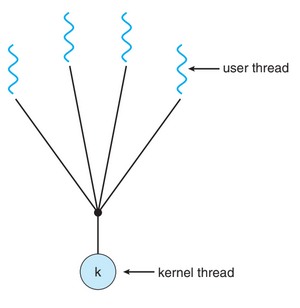

# Threads

## Overview

A thread is a basic unit of CPU utilization; it comprises a thread ID, a program counter a register set, and a stack. It shares with other threads belonging to the same process its code section, data section, and other operation-system resources, such as open files and signals

A traditional (or heavyweight) process has a single thread of control. If a process has multiple threads of control, it can perform more than one task at a time.

### Motivation

Process creating is time consuming and resource intensive. It is generally more efficient to use one process that contains multiple threads.

### Benefits

- **Responsiveness**: Multi-threading an interactive application may allow a program to continue running even if a part of it is blocked or is performing a lengthy operation.
- **Resource sharing:** Threads share the memory and the resources of the process to which they belong by default.
- **Economy:** Because threads share the resources of the process to which they belong, it is more economical to create and context-switch threads.
- **Scalability**

## Multi-core Programming

In response to the need for more computing performance, single-CPU system evolved into multi-CPU systems. A similar trend in system design is to place multiple computing cores on a single chip. Each core appears as a separate processor to the OS. → Multi-core/Multiprocessor systems.

Multi-threaded programming provides a mechanism for more efficient user of these multiple computing cores and improved concurrency.

Consider a system with 4 threads. On a system with a single computing core, *concurrency* merely means that the execution of the threads will be interleaved over time, because the processing core is capable of executing only one thread at a time. On a system with multiple cores, however, concurrency means that the threads can run in *parallel*, because the system can assign a separate thread to each other.

**Parallelism**: a system is parallel if it can perform more than one task simultaneously.

**Concurrent**: supports more than one task by allowing all the tasks to make progress.

It is possible to have concurrency without parallelism.

Before the advent of multi-core architectures, most computer systems had only a single processor. CPU schedulers were designed to provide the illusion of parallelism by rapidly switching between processes in the system, thereby allowing each process to make progress. → running concurrently, but not parallel

**Data parallelism** → focuses on distributing subsets of the same data across multiple computing cores and performing the same operation on  each core.

**Task parallelism** → involves distributing not data but tasks (threads) across multiple computing cores. Each thread is performing a unique operation. Different threads may be operating on the same data, or they may be operating on different data.

In practice, few applications strictly follow either data or task parallelism. In most instances, applications use a hybrid of these two strategies.

## Multi-threading Models

Support for threads may be provided either at the user level, for *user threads*, or by the kernel, for *kernel threads*.

User threads are supported above the kernel and are managed without kernel support.

Kernel threads are supported and managed directly by the operating system. Ultimately, a relationship must exist between user threads and kernel threads.

### Many-to-One Model

Maps many user-level threads to one kernel thread.

Thread management is done by thread library in user space, so it is efficient. However, the entire process will block if a thread makes a blocking system call. Also, because only one thread can access the kernel at a time, multiple threads are unable to run in parallel on multi-core system.



### One-to-One Model

Maps each user thread to a kernel thread.

Provides more concurrency than the many-to-many model by allowing another thread to run when a thread make a blocking system call. Is also allows multiple threads to run in parallel on multi-processors. The only drawback to this model is that creating a user thread requires creating the corresponding kernel thread. Most implementation of this model restrict the number of threads supported by the system.


### Many-to-Many Model

Multiplexes many user-level threads to a smaller or equal number of kernel threads.The number of kernel threads may be specific to either a particular application or a particular machine.

The many-to-may model developers can create as many user threads as necessary, and the corresponding kernel threads can run in parallel on a multi-processor. Also, when a thread performs a blocking system call, the kernel can schedule another thread for execution.

## Thread Libraries

Thread library provides programmer with API for creating and managing threads.

Two primary ways of implementing

- Library entirely in user space → all code and data structures for the library exist in user space.
- Kernel-level library supported by the OS → code and data structures for the library exist in kernel space.

### Pthreads

Pthreads refers to the POSIX standard defining an API for thread creation and synchronization. This is a specification for thread behavior, not an implementation. OS designers may implement the specification in any way they wish.

Basic Pthread API for constructing a multi-threaded program that calculates the summation of a non-negative integer in a separate thread:

```c
#include <pthread.h>
#include <stdio.h>
int sum; /* this data is shared by the thread(s) */
void *runner(void *param); /* threads call this function */
int main(int argc, char *argv[])
{
	pthread t tid; /* the thread identifier */
	pthread attr t attr; /* set of thread attributes */
	if (argc != 2) {
		fprintf(stderr,"usage: a.out <integer value>\n");
		return -1;
	}
	if (atoi(argv[1]) < 0) {
		fprintf(stderr,"%d must be >= 0\n",atoi(argv[1]));
		return -1;
	}
	/* get the default attributes */
	pthread attr init(&attr);
	/* create the thread */
	pthread create(&tid,&attr,runner,argv[1]);
	/* wait for the thread to exit */
	pthread join(tid,NULL);

	printf("sum = %d\n",sum);
}
/* The thread will begin control in this function */
void *runner(void *param)
{
	int i, upper = atoi(param);
	sum = 0;
	for (i = 1; i <= upper; i++)
	sum += i;

	pthread exit(0);
}
```

Joining 10 Threads

```c
#define NUM_THREADS 10
/* an array of threads to be joined upon */
pthread_t workers[NUM_THREADS];

for(int i = 0; i < NUM_THREADS; i++)
	pthread_join(workers[i], NULL);
```

## Implicit Threading

Programs  may contain hundreds - or even thousands - of threads.

One way to address these difficulties and better support the design of multi-threaded applications is to transfer the creation and management of  threading from applications developers to compilers and run-time libraries. → Implicit treading

### Thread Pools

Issues:

Amount of time required to create the thread, together with the fact that the thread will be discarded once it has completed its work.

If we allow concurrent requests to be serviced in a new thread, we have not placed a bound on the number of threads concurrently active in the system. Unlimited threads could exhaust system resources, such as CPU time or memory.

One solution is to use thread pool

The general idea is to create a number of threads at process startup and place them into a pool, where they sit and wait for work. When a server receives a request, it awakens a thread from this pool - if one is available - and passes it the request for service. Once the thread completes its service, it returns to the pool and awaits more work. If the pool contains no available thread, the server waits until one becomes free.

### OpenMP

Is a set of compiler directives as well as an API for programs written in C, C++, or FORTRAN that provides support for parallel programming in shared-memory environment.

It identifies parallel regions as blocks of code that may run in parallel. Applications developers  insert compiler directive into their code at parallel regions, and these directives instruct the OpenMP run-time library to execute the region in parallel.

The following code illustrates a compiler directive above the parallel region containing the printf() statement:

 

```c
#include <omp.h>
#include <stdio.h>
int main(int argc, char *argv[])
{
	/* sequential code */
	#pragma omp parallel
	{
		printf("I am a parallel region.");
	}
	/* sequential code */
	return 0;
}
```

When the OpenMP encounters the directive *#pragma omp parallel* it creates as many threads are processing cores in the system. Thus, for a dual-core system, two threads are created, for a quad-core system four are created; and so forth. All the threads then  simultaneously execute the parallel region. As each exits the parallel region, it is terminated.

OpenMP provides directives for running code regions in parallel, including paralleling loops.

```c
#pragma omp parallel for
for (i = 0; i< N; i++) {
	c[i] = a[i] + b[i];
}
```

### Grand Central Dispatch

Grand Central Dispatch (GCD) is a combination of extensions to C language, and API, and a run-time library that allows applications developers to indentify sections of code to run in parallel. Like OpenMP, GCD manages most of the details of threading.

A block is simply a self-contained unit of work. It is specified by a caret ^ inserted in front of a pair of braces.

```c
^{printf("I am a block");}
```

GCD schedules blocks for run-time execution by placing them on a dispatch queue. When it removes a block from a queue, it assigns the block to an available thread from the thread pool it manages. GCD identifies two types of dispatch queues: serial and concurrent.

Serial:

1. Block is removed from FIFO order
2. Complete execution before another block is removed.
3. Each process has its own serial queue(main queue)

Developers can create additional serial queues that are local to particular processes. Serial queues are useful for ensuring the sequential execution of several tasks

Concurrent:

1. Block is removed from FIFO order (several may be removed at a time)
2. Multiple blocks can execute in parallel.
3. Blocks are distinguished according  to priority: low, default, and high.

Priorities represent an aproximation of the relative importance of blocks. Quite simply, blocks with a higher priority should be placed on the high  priority dispatch queue.

Following code segment illustrates obtaining the default-priority concurrent queue and submitting a block to the queue using the dispatch_async() function:

```c
dispatch queue t queue = dispatch get global queue
	(DISPATCH QUEUE PRIORITY DEFAULT, 0);

dispatch async(queue, ˆ{ printf("I am a block."); });
```

Internally, GCD’s thread pool is composed of POSIX threads. GCD activily manages the pool, allowing the number of threads to grow and shrink according to application demand and system capacity.

## Threading Issues